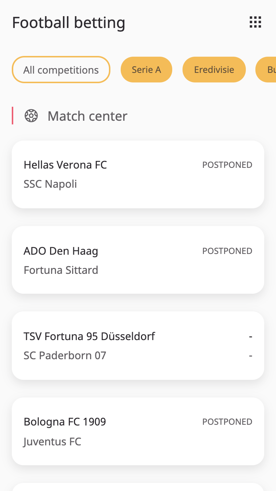

<div align="center">
	<h1 align='center'>Progressive Web Apps</h1>
	
</div>
<p align="center">
	Server side rendered application football betting application.
	<br>
	<!-- <a href="https://real-time-web-1819-pq.herokuapp.com/">Live demo</a> -->
</p>
<br>

## Table of contents

- [Install](#install)
- [Wiki](#wiki)
- [API](#api)
- [Status](#status)
- [Sources](#sources)

## Install
This is a Node and Express based application. You must have [Node.js](https://nodejs.org/en/download/) installed on your computer to run this project. To install this project on your computer, please follow the steps below from your command line:

```shell
# Clone repository
git clone https://github.com/peppequint/progressive-web-apps-1920.git

# Go to the repository
cd progressive-web-apps-1920

# Install dependencies
npm install

# Runs build scripts and starts nodemon
npm start

# Optional: automatically watch every change that is made in a css file
npm run watch:css
```

A configured `.env` with an `API_KEY` is needed	to run this application. The API is free to use. 

## Wiki
The documentations of this project can be found in the Wiki of this project. To complete this assessment, I have to achieve some learning goals. I have divided these learning goals into a number of topics and in the Wiki I explain what I have done for this topics. Please, click on [this link](https://github.com/peppequint/progressive-web-apps-1920/wiki) to read the documentation.

## API
The API that is used for this application is from [Football Data](https://www.football-data.org/). This is a developer friendly football API, really easy and free to use. For this project the free tier package is used. This package includes 12 competitions with the fixtures, schedules and all the teams of the league with detailed information per topic. There is a maximum of 10 calls per minute. 
In the [Wiki](#) you can read more about how the API is used.


When a user starts the application, the following will happen on the server side.
In order to get all the matches that are scheduled for this day, `const matches` will fetch all the matches. After all matches have been fetched, the 12 competitions are also fetched, `const competitions`. When this is done, when everything is 'promised', the data will be rendered to index.

``` javascript
app.get('/', (req, res) => {
  const matches = new Promise((resolve, reject) => {
    fetch('https://api.football-data.org/v2/matches', {
      headers: { 'X-Auth-Token': process.env.API_KEY }
    })
      .then(res => {
        return res.json();
      })
      .then(data => {
        resolve(data);
      });
  });

  const competitions = new Promise((resolve, reject) => {
    fetch('https://api.football-data.org/v2/competitions?plan=TIER_ONE', {
      headers: { 'X-Auth-Token': process.env.API_KEY }
    })
      .then(res => {
        return res.json();
      })
      .then(data => {
        resolve(data);
      });
  });

  Promise.all([matches, competitions]).then(data => {
    res.render('pages/index', { matches: data[0].matches, competitions: data[1].competitions });
  });
});
```

## Status
The application is still work in progress. Things that needs to be done:
- [ ] Service worker
- [ ] Offline availability 
- [ ] Progressive enhancement
- [ ] Critical render path
- [ ] Caching

## Sources
- [Football data](https://www.football-data.org/)
- [EJS](https://ejs.co/)
- [Icons](https://developer.microsoft.com/en-us/fabric#/styles/web/icons#fabric-icons-tool)