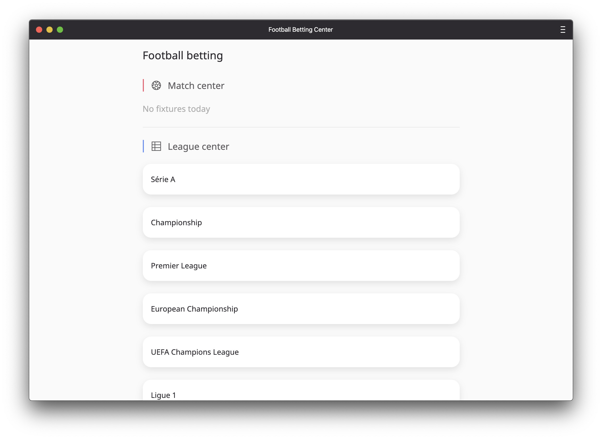

<div align="center">
	<h1 align='center'>Progressive Web Apps</h1>
	
</div>
<p align="center">
	<br>
	Server side rendered application football betting application.
	<br>
	<a href="https://progressive-web-apps-1920.herokuapp.com/">Live demo</a>
</p>
<br>

## Table of contents

- [Install](#install)
- [Wiki](#wiki)
- [API](#api)
- [Status](#status)
- [Sources](#sources)

## Install
This is a Node and Express based application. You must have [Node.js](https://nodejs.org/en/download/) installed on your computer to run this project. To install this project on your computer, please follow the steps below from your command line:

```shell
# Clone repository
git clone https://github.com/peppequint/progressive-web-apps-1920.git

# Go to the repository
cd progressive-web-apps-1920

# Install dependencies
npm install

# Runs build scripts and starts nodemon
npm run dev
```

This project also uses different scripts to speed up the process of developing during the project. In the [`package.json`](https://github.com/peppequint/progressive-web-apps-1920/blob/master/package.json) file you can see what all the different scripts are.

```shell
# Evokes different build scripts
npm run build

# Watches live changes
npm run watch
```

A configured `.env` with an `API_KEY` is needed	to run this application. The API is free to use. 

## Wiki
The documentations of this project can be found in the Wiki of this project. To complete this assessment, I have to achieve some learning goals. I have divided these learning goals into a number of topics and in the Wiki I explain what I have done for this topics. Please, click on [this link](https://github.com/peppequint/progressive-web-apps-1920/wiki) to read the documentation.

## API
The API that is used for this application is from [Football Data](https://www.football-data.org/). This is a developer friendly football API, really easy and free to use. For this project the free tier package is used. This package includes 12 competitions with the fixtures, schedules and all the teams of the league with detailed information per topic. There is a maximum of 10 calls per minute. 
In the [Wiki](#https://github.com/peppequint/progressive-web-apps-1920/wiki/Server-side-rendering) you can read more about how the API is used.

## Status
The application is still work in progress. Things that needs to be done for the best performance and optimization:
- [x] .env
- [x] Manifest
- [x] Service worker
- [x] Caching
- [x] Offline availability 
- [ ] Critical render path

## Sources
- [Football data](https://www.football-data.org/)
- [EJS](https://ejs.co/)
- [Icons](https://developer.microsoft.com/en-us/fabric#/styles/web/icons#fabric-icons-tool)
- [Async functions](https://alligator.io/js/async-functions/)

## Acknowledgment
Big thanks to [Declan](https://github.com/decrek), who gave great lectures and created clear code to understand the complexity of the different subjects.